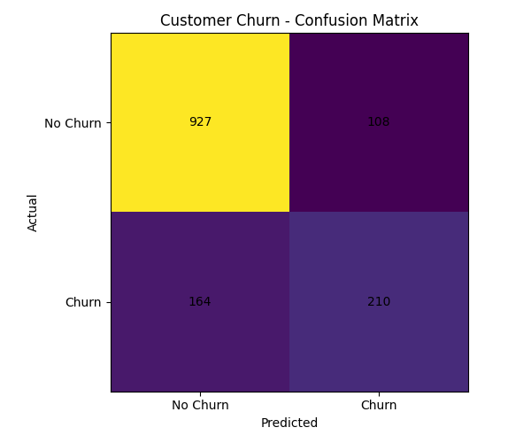

# Customer Churn Prediction & Risk Scoring

## Project Overview

Customer Churn Prediction & Risk Scoring is a machine learning project that predicts whether a customer is likely to leave a service.

The project uses customer information such as tenure, monthly charges, contract type, internet service, payment method, and support-related information to predict churn probability.

The prediction probability is converted into three simple risk levels:

* **Low Risk:** 0–30%
* **Medium Risk:** 31–70%
* **High Risk:** 71–100%

The project also includes SQL-based customer analysis and an interactive Streamlit application.

## Live Demo

🚀 **Streamlit Application:**
https://customer-churn-prediction-d2pp2rcuprk3wpnp5yauyy.streamlit.app/

The live application allows users to enter customer information and receive a churn probability and risk level.

## Key Features

* Customer churn prediction using Machine Learning
* Data cleaning and preprocessing
* Missing-value handling
* Categorical feature encoding
* Numerical feature scaling
* Logistic Regression
* Random Forest model comparison
* Model evaluation using Accuracy, Precision, Recall, F1 Score, and ROC-AUC
* Confusion matrix
* Churn probability prediction
* Risk-level classification
* SQLite database
* SQL-based customer analysis
* Interactive Streamlit application
* Model saving and loading using Joblib

## Technology Stack

### Programming

* Python
* SQL

### Data Processing

* Pandas
* NumPy

### Machine Learning

* Scikit-learn
* Logistic Regression
* Random Forest

### Database

* SQLite

### Application

* Streamlit

### Visualization

* Matplotlib

### Model Management

* Joblib

## Dataset

The project uses the **IBM Telco Customer Churn dataset**.

Dataset size:

* **7,043 customer records**
* **21 original columns**

The dataset contains information related to:

* Customer demographics
* Partner and dependent status
* Tenure
* Phone services
* Internet services
* Online security and backup
* Device protection
* Technical support
* Streaming services
* Contract type
* Billing information
* Payment method
* Monthly charges
* Total charges
* Customer churn

The `customerID` column is removed during preprocessing because it is an identifier and does not provide useful predictive information.

## Machine Learning Workflow

```text
Customer Dataset
       ↓
Data Cleaning
       ↓
Handle Missing Values
       ↓
Remove Customer ID
       ↓
Categorical Feature Encoding
       ↓
Train-Test Split
       ↓
Numerical Feature Scaling
       ↓
Model Training
       ↓
Model Evaluation
       ↓
Churn Probability
       ↓
Risk Level
       ↓
Streamlit Application
```

## Model Training & Evaluation

Two classification models were evaluated:

### Logistic Regression

| Metric    |  Score |
| --------- | -----: |
| Accuracy  | 80.70% |
| Precision | 66.04% |
| Recall    | 56.15% |
| F1 Score  | 60.69% |
| ROC-AUC   | 84.23% |

### Random Forest

| Metric    |  Score |
| --------- | -----: |
| Accuracy  | 78.50% |
| Precision | 62.03% |
| Recall    | 48.93% |
| F1 Score  | 54.71% |
| ROC-AUC   | 82.26% |

Logistic Regression was selected for the current project version because it achieved better results than Random Forest on the evaluated test set across the reported metrics.

## Confusion Matrix

The Logistic Regression model produced the following confusion matrix on the test dataset:

```text
[[927 108]
 [164 210]]
```

* **True Negatives:** 927
* **False Positives:** 108
* **False Negatives:** 164
* **True Positives:** 210



## Streamlit Application

The project includes an interactive Streamlit application for customer churn prediction.

The application accepts customer information such as:

* Gender
* Senior citizen status
* Partner and dependent status
* Tenure
* Phone service
* Internet service
* Online security
* Online backup
* Device protection
* Technical support
* Streaming services
* Contract type
* Paperless billing
* Payment method
* Monthly charges
* Total charges

The application displays:

* **Churn Probability**
* **Risk Level**

### Example Output

```text
Churn Probability: 28.09%
Risk Level: Low Risk
```


## SQL Analysis

SQLite is used to store and analyze the customer dataset.

The project includes SQL queries for:

* Total customer count
* Total churned customers
* Churn by contract type
* Average monthly charges
* Average monthly charges by churn status
* Churn by internet service
* Churn by payment method

SQL queries are available in:

```text
sql/analysis_queries.sql
```

## SQL Analysis Results

### Overall Customer Statistics

| Metric                  | Result |
| ----------------------- | -----: |
| Total Customers         |  7,043 |
| Churned Customers       |  1,869 |
| Overall Churn Rate      | 26.54% |
| Average Monthly Charges |  64.76 |

### Churn by Contract Type

| Contract Type  | Churn Rate |
| -------------- | ---------: |
| Month-to-month |     42.71% |
| One year       |     11.27% |
| Two year       |      2.83% |

### Churn by Internet Service

| Internet Service    | Churn Rate |
| ------------------- | ---------: |
| DSL                 |     18.96% |
| Fiber optic         |     41.89% |
| No internet service |      7.40% |

### Churn by Payment Method

| Payment Method            | Churn Rate |
| ------------------------- | ---------: |
| Electronic check          |     45.29% |
| Mailed check              |     19.11% |
| Bank transfer (automatic) |     16.71% |
| Credit card (automatic)   |     15.24% |

These results describe associations observed in the dataset and do not establish causation.

## Project Structure

```text
customer-churn-prediction/
│
├── app/
│   └── app.py
│
├── data/
│   └── Telco-Customer-Churn.csv
│
├── models/
│   ├── churn_model.pkl
│   └── scaler.pkl
│
├── results/
│   ├── model_results.txt
│   ├── confusion_matrix.png
│   └── streamlit_prediction.png
│
├── sql/
│   ├── run_query.py
│   └── analysis_queries.sql
│
├── development/
│   ├── check_data.py
│   ├── check_missing.py
│   ├── check_categories.py
│   ├── check_numbers.py
│   ├── check_churn_contract.py
│   ├── check_churn_tenure.py
│   └── train_test_split.py
│
├── preprocess_data.py
├── train_model.py
├── predict.py
├── create_database.py
├── requirements.txt
├── .gitignore
└── README.md
```

## Installation

Clone the repository:

```bash
git clone https://github.com/Sowndarya-J/customer-churn-prediction.git
```

Move into the project directory:

```bash
cd customer-churn-prediction
```

Install the required packages:

```bash
pip install -r requirements.txt
```

## Train the Model

Run:

```bash
python train_model.py
```

This performs:

* Data loading
* Data cleaning
* Missing-value handling
* Categorical encoding
* Train-test splitting
* Feature scaling
* Model training
* Model evaluation
* Model saving
* Confusion matrix generation

## Make a Prediction

Run:

```bash
python predict.py
```

The script loads the trained model and scaler and generates:

* Churn probability
* Risk level

## Run the Streamlit Application

Run:

```bash
streamlit run app/app.py
```

## Database Setup

Create the SQLite database using:

```bash
python create_database.py
```

This creates the local database:

```text
customer_churn.db
```

The database contains the `customer_data` table.

## Risk Scoring

The project uses the following project-defined risk thresholds:

| Churn Probability | Risk Level  |
| ----------------- | ----------- |
| 0–30%             | Low Risk    |
| 31–70%            | Medium Risk |
| 71–100%           | High Risk   |

These thresholds are simple project rules used to make the prediction easier to interpret.

## Key Learning Outcomes

This project provided practical experience with:

* Data cleaning
* Missing-value handling
* Categorical encoding
* Feature scaling
* Train-test splitting
* Classification algorithms
* Logistic Regression
* Random Forest
* Model evaluation
* Confusion matrix
* ROC-AUC
* Prediction probability
* Risk scoring
* SQL analysis
* SQLite database operations
* Streamlit application development
* Joblib model persistence

## Future Improvements

Possible future improvements include:

* Hyperparameter tuning
* Cross-validation
* Additional model experimentation
* Probability calibration
* Advanced feature engineering
* Interactive analytics dashboards
* Improved risk scoring
* Cloud deployment enhancements

